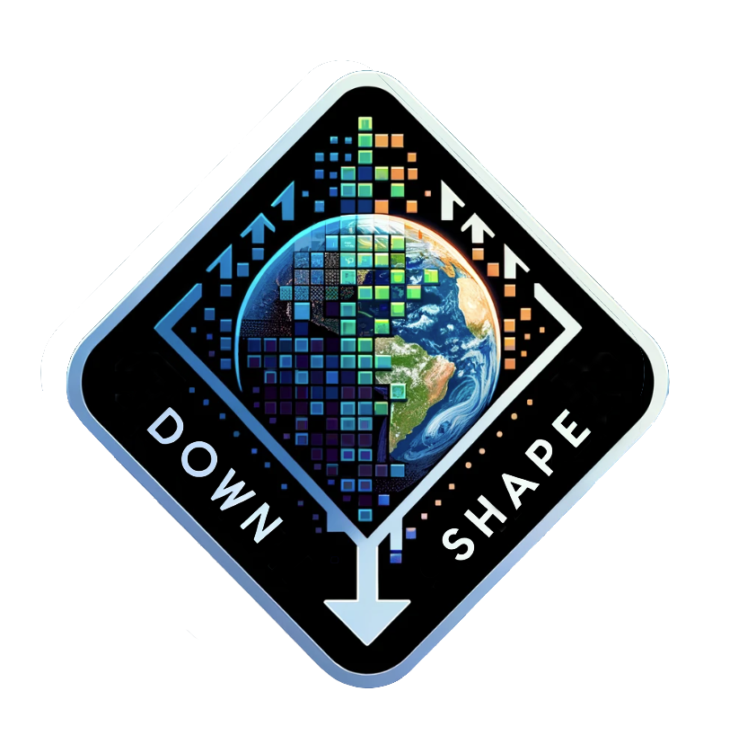

  

{fig-align="center" width=300}

# :clipboard: Basic Overview 

:red_circle: *downshape* is an R research compendium exposing functions to search, download, preprocess and bias-adjust CMIP6 data discovered via the [ESGF Search RESTful API](https://esgf.github.io/esg-search/ESGF_Search_RESTful_API.html). Major preprocess step made with [CDO swofware](https://code.mpimet.mpg.de/projects/cdo/). This compendium allow to download observed data come from Copernicus website or other website with URL of variable. We can choose to download bathymetry variable come from CDO.

```{R}
#| echo: false
#| output : asis
project_mermaid_graph <- targets::tar_mermaid(script = "_targets.R", 
                                              targets_only = TRUE, 
                                              legend = FALSE, 
                                              color = FALSE)
cat("```mermaid\n")
cat(paste(project_mermaid_graph, collapse = "\n"))
cat("\n```")
```

# :point_right: Step by step 

- :one: Import files necessary into data folder (information bellow)
- :two: Edit targets of *_targets.R* file into project parameters part and check if all "skip" argument into targets function are "FALSE" (or "TRUE" if you want skip some targets).
- :three: Select the part the part of *_targets.R* script you want run. Commit all targets of the part not used. It's impossible to run the two parts in same time.
- :four: Run pipeline launching *make.R* script

# :heavy_check_mark: Input Informations

## Data folder

:heavy_check_mark: **[copernicus_parameters.csv]**: CSV file. Parameters of the data we wish to download, with one row per variable to be downloaded. Please refer to the table structure requirements below. If a variable is large, the Copernicus API may not be able to download it, and it will be necessary to divide the variable into several smaller time periods (use the "divide", "subvar", and "septime" arguments of the copernicus_download_api() function). If a parameter in this table does not exist for your product (for example: depth), simply leave the cell empty. Columns "date_min" and "date_max" must be equal to or later than the current_period target (in the _targets.R file). To create a baseline for applying the change factor method to a CMIP variable, there must be an overlap between "date_min"-"date_max" and the historical_period target.

| Columns database | Description |
| :----: |   :-------------: |
| my_variable_name              | Your variable name (outside api command). Each name must be unique | 
| dataset_id              | Check on Copernicus website | 
| dataset_version            | Check API request on Copernicus website |
| longitude_min             | Extend of map downloaded |
| longitude_max             | Extend of map downloaded |
| latitude_min            | Extend of map downloaded | 
| latitude_max             | Extend of map downloaded |
| date_min        | Date.  Format *Year-Month-Day* hours:minutes:seconds (2017-11-25 12:20:00) |
| date_max             | Date.  Format *Year-Month-Day* hours:minutes:seconds (2017-11-25 12:20:00) |
| depth_min         | Numeric. Depth in meters. If you want to download one depth layer, same value for "depth_min" and "depth_max". If it's a 3D variable (with depth dimension) the depth must be provided otherwise leave the cell empty |
| depth_max           | Numeric. Depth in meters. If you want to download one depth layer, same value for "depth_min" and "depth_max". If it's a 3D variable (with depth dimension) the depth must be provided otherwise leave the cell empty |
| variable          | Short name of variable downloaded. If several variable by product create one line by variable in the table |
| DOI          | Check on Copernicus website |          

:heavy_check_mark: **[Mask_PA_variable.shp]** : Shapefile. Mask of study area to crop environmental rasters with CDO. This shapefile will be convert to NETCDF file with *gdal* before being used by CDO.

## Targets script
:heavy_check_mark: **[experiments]** : To select ssp scenario downloaded (check on esgf website menu)

:heavy_check_mark: **[vars]** : To select cmip6 variables want to download (check on esgf website menu). Add component and speed variables (the both) there are into "vars_speed_cmip" target.

:heavy_check_mark: **[freq]** : To select frequence of cmip6 variables want to download (check on esgf website menu).

:heavy_check_mark: **[historical_period]** : List start and end time. To define min and max time borns of cmip6 data historical period (cdo format: "YYYY-MM-DDThh:mm:ss"). Complet ssp "historical" period would you like. It must existe a time overlap with *time_span* target. Into CMIP6 ssp "historical" stop at 2014 years, but to match baseline and ssp "historical" periods it's necessary to merge historical and a short ssp periods (it's the goal of mergeHistorical_cmip function).

:heavy_check_mark: **[future_period]** : List start and end time. To define min and max time borns of cmip6 data future period (cdo format: "YYYY-MM-DDThh:mm:ss"). Complet ssp period would you like (without ssp "historical"). It must existe a time overlap with *time_span* target (period downloaded) and entire overlap with baseline_period target (to create same period between baseline and historical). "start" vector correspond at "end" vector of *historical_period* target +1 day.

:heavy_check_mark: **[time_span]** : To select min and max time of cmip6 variables downloaded (format example:"1982-01-01T00:00:00Z"). It must existe a time overlap with *historical_period* and *future_period* targets. If you want to apply change factor method, min born correspond to min born of *historical_period* target and max born corespond to max born of *future_period* target.

:heavy_check_mark: **[vars_speed_cmip]** : Same informations of *vars_speed* target but for cmip6 variables. All vectors of this target list can to be empty.

:heavy_check_mark: **[climato_period]** : List of vectors. Allow to name and define climatology periods use to apply change factor method (climatology on cmip6 ssp). "name" vector is how will be called climatology period and correspond to "start" and "end" vector define time bornes of climatology period (cdo format: "YYYY-MM-DDThh:mm:ss"). "month_choose" vector allow to choose month conserved into the climatology mean calcul (used into mean_month() function). It must existe a time overlap with *future_period* target.

:heavy_check_mark: **[resotempo]** : Give temporal resolution of all variable (copernicus or cmip or both) you want to mean by week with remapCDO(..., monthWeek = "week"). Complete "reso" list with "week" (if variable have one layer by week), "day" (if variable have one layer by day), "month" (one by month), "hour1" (one by one hour), "hour6" (one by 6 hours), "FIXE" one layer for all NetCDF file. Into "vars" list given variable name into "my_variable_name" column of **parameters_copernicus.csv** (same of "tabname" into **[renameVar]**). For speed variables give the output variable names inside **[vars_speed]** (called "name").

:heavy_check_mark: **[http_vars]** : List. List of download path (NetCDF file) and variable names. First (or n) element of "http" vector correspond to first (or n) element of "name" vector. "Name" vector will be the name used to rename file name of variable. To download variables outsite copernicus website. Leave empty if not used.

:heavy_check_mark: **[current_period]** : List start and end time. To define min and max time of copernicus data current period (cdo format: "YYYY-MM-DDThh:mm:ss"). Allow to calibrate model (weekly temporal resolution) and create current projection (monthly temporal resolution). This period must overlap all variable periods downloaded into **copernicus_parameters.csv**.

:heavy_check_mark: **[baseline_period]** : List start and end time. Complet this target if you want create a baseline to apply change factor method, otherwise write "NULL" into "start" and "end" arguments. It allow to define min and max time borns of baseline period (cdo format: "YYYY-MM-DDThh:mm:ss"). 

:heavy_check_mark: **[match_name]** : List of two vectors. Allow to correspondance between "copernicus" and "cmip" variables during calcul of delta in change factor method. List uniquelly variables you want bias-corrected. These vectors must to contain all variables name create during process (variable processed by speed_vars and deep_level targets).

:heavy_check_mark: **[spat_reso]** : List of number. Spatial resolution of initial variables is degraded to "reso" degrees resolution (resolution must be higher than all initial resolutions). All variables are interpolated because their grids must match, so you must specify the number of rows and columns of the new grid, "grid_nrow" and "grid_ncol" respectively.

:heavy_check_mark: **[deep_level]** : List start and end deep level by file created. To split variable to several files by deep level. First (or n) element of "start" vector correspond to first (or n) element of "end" vector. vectors of the list can be empty.

:heavy_check_mark: **[renameVar]** : List with "my_variable_name" column value into "copernicus_parameters.csv" table and new name you want inside netcdf file. First (or n) element of "tabname" vector correspond to first (or n) element of "newname" vector. Allow to rename into NETCDF file the variable juste after downloading step. The name of file stay with "my_variable_name" column value. This vectors gathers all variable names used to rename cmip6 and copernicus data **just after download step**. In others words, it allows to change name of "variable" column into **parameters_copernicus.csv** and "Variable_id" column into **selected_datasets.csv** for cmip6 data. If variable name have a name with "_", "-", "#", " ", rename with **rename** target to one word without specials characters otherwise CDO command doesn't work. All vectors of this target list can to be empty. If bathymetry is downloaded by downloadCDO_bathy() it will be called "BATHY" and variable name inside the NetCDF file will be not rename (called "topo").

:heavy_check_mark: **[vars_speed]** : List first, second component and output variable name. To calcul copernicus variables speed with two components. First (or n) element of "compo1" vector correspond to first (or n) element of "compo2" vector. All variables must have unique component names. The first and second vector give the variable names into "my_variable_name" column of **parameters_copernicus.csv** (same of "tabname" into **[renameVar]**).

:heavy_check_mark: **[bathy_CDO]** : Logical. If "TRUE" bathymetry variable from CDO are downloaded into "data_copernicus" folder. The name of variable is "topo_cdo_NOAA_ETOPO2_2006_brut.nc". If "FALSE" bathymetry doesn't downloaded.

:heavy_check_mark: **[ano_vars]** : character. Name of the variable with which you want to calculate the anomaly. This calculation uses the climatology of the same variable, and the climatology file name must be the same as the variable in the output folder with this format. Monthly and weekly climatology must to be availables: 'SST0x100_climatology_XX_XXX_week.tif' and 'SST0x100_climatology_XX_XXX_month.tif'.

## :bookmark: Other pipeline usage and input data

:triangular_flag_on_post: **If you want skip copernicus_download_api() function** : You can put variables (.nc) into folder "output/data_copernicus" with file called "copernicus_parameters_modified" create during downloading data. Variable want to be named *NameVar_XXXX_XXX_XXX_XXXX_DateBegining-DateFinal.nc.*. 

:triangular_flag_on_post: **If you want skip download_cmip_data() function** : You can put variables (.nc) into folder "output/data_cmip6" with subfolders by model and experiment. Variable want to be named *NameVar_XXXX_model_experiment_XXXX_XXX_DateBegining-DateFinal.nc.*

:warning: "NameVar" want to be the same of name inside NetCDF file (check it otherwise renameCDO() function bug). Variables must to be with WGS84 projection (EPSG:4326).

# :key: Dependencies

:arrow_forward: To download Copernicus data it's necessary to install [python3](https://www.python.org/downloads/) and [Copernicus marine ToolBox](https://help.marine.copernicus.eu/en/articles/7970514-copernicus-marine-toolbox-installation) (Ubuntu command: *python3 -m pip install copernicusmarine*).

:arrow_forward: To formate cmip data it's necessary to install [gdal](https://gdal.org/download.html), [cdo](https://code.mpimet.mpg.de/projects/cdo/embedded/index.html#x1-30001.1), [nco](https://command-not-found.com/ncrename).

:arrow_forward: This R research compendium using renv package to fixe package version. Run renv::restore() to update your packages in your computer and renv::status() to check if everything is ready.

# :pushpin: Output folders structuration

:information_source: Variable with "1x100", "0x1", etc... into file name are integrated (depth mean) between values before and after the "x". Variable file without "x" pattern into number are integrated on all depth available (if depth are available for the variable).

- :open_file_folder:  output *--[make.r]--*
  - :page_facing_up: dataset_found_before_filter.csv *--[select_dataset()]--*
  - :page_facing_up: selected_datasets.csv *--[select_dataset()]--*
  - :open_file_folder: data_cmip6 *--[download_cmip_data()]--*
    - :open_file_folder: Model_name_download *--[download_cmip_data()]--*
      - :open_file_folder: Experiment_name_download *--[download_cmip_data()]--*
        - :page_facing_up: ModelName_ExperimentName_VarsName.sh *--[download_cmip_data()]--*
        - :page_facing_up: Vars1.nc *--[download_cmip_data()]--*
        - :page_facing_up: Vars2.nc *--[download_cmip_data()]--*
        - :page_facing_up: VarsX.nc ... *--[download_cmip_data()]--*
  - :open_file_folder: data_cmip6_change_factor *--[climato_cmip()]--*
    - :open_file_folder: climatology *--[climato_cmip()]--*
      - :open_file_folder: Name_climatology (ex : 2030)
        - :open_file_folder: Model_name_download  
          - :open_file_folder: Experiment_name_download 
            - :page_facing_up: Vars1.grd 
            - :page_facing_up: Vars2.grd  
            - :page_facing_up: VarsX.grd ...
            - :page_facing_up: VarsDepth1x100.nc 
            - :page_facing_up: Vars_speed.grd 
    - :open_file_folder: historical_ssp_merged *--[mergeHistorical_cmip()]--*
      - :open_file_folder: Model_name_download  
        - :open_file_folder: Experiment_name_download 
          - :page_facing_up: Vars1.grd 
          - :page_facing_up: Vars2.grd  
          - :page_facing_up: VarsX.grd ...
          - :page_facing_up: VarsDepth1x100.nc
          - :page_facing_up: Vars_speed.grd 
    - :open_file_folder: variables_bias-corrected *--[deltaCF()]--*
      - :open_file_folder: Name_climatology (ex : 2030)
        - :open_file_folder: Model_name_download
          - :open_file_folder: Experiment_name_download
            - :page_facing_up: Vars1.grd 
            - :page_facing_up: Vars2.grd  
            - :page_facing_up: VarsX.grd ...
            - :page_facing_up: VarsDepth1x100.nc 
            - :page_facing_up: Vars_speed.grd 
    - :open_file_folder: variables_bias-corrected_mean *--[meanMod()]--*
      - :open_file_folder: Name_climatology (ex : 2030) 
        - :open_file_folder: Experiment_name_download 
          - :open_file_folder: Gradient *--[grad_cmip()]--*
          - :page_facing_up: Vars1.grd 
          - :page_facing_up: Vars2.grd  
          - :page_facing_up: VarsX.grd ...
          - :page_facing_up: VarsDepth1x100.nc 
          - :page_facing_up: Vars_speed.grd 
  - :open_file_folder: data_cmip6_remapped *--[remapCDO_cmip()]--* 
    - :open_file_folder: Model_name_download *--[remapCDO_cmip()]--* 
      - :open_file_folder: Experiment_name_download *--[remapCDO_cmip()]--*
        - :page_facing_up: Vars1.nc *--[remapCDO_cmip()]--* 
        - :page_facing_up: Vars2.nc *--[remapCDO_cmip()]--* 
        - :page_facing_up: VarsX.nc ...*--[remapCDO_cmip()]--*
        - :page_facing_up: VarsDepth1x100.nc ...*--[remapCDO_cmip()]--* 
        - :page_facing_up: Vars_speed.nc *--[speedCompo_cmip()]--*
  - :open_file_folder: data_copernicus *--[copernicus_download_api()]--*
    - :page_facing_up: copernicus_parameters_modified.csv *--[copernicus_download_api()]--*
    - :page_facing_up: Vars1.nc *--[copernicus_download_api()]--*
    - :page_facing_up: Vars2.nc *--[copernicus_download_api()]--*
    - :page_facing_up: VarsX.nc ... *--[copernicus_download_api()]--*
  - :open_file_folder: data_copernicus_remapped *--[remapCDO_copernicus()]--*
    - :open_file_folder: month
      - :page_facing_up: Vars1.nc *--[remapCDO_copernicus()]--* 
      - :page_facing_up: Vars2.nc *--[remapCDO_copernicus()]--* 
      - :page_facing_up: VarsX.nc ...*--[remapCDO_copernicus()]--*
      - :page_facing_up: VarsDepth1x100.nc *--[remapCDO_copernicus()]--*
      - :page_facing_up: Vars_speed.nc *--[speedCompo_copernicus()]--*
      - :open_file_folder: GRD *--[connectPip()]--*
        - :page_facing_up: Vars1.nc
        - :page_facing_up: Vars2.nc
        - :page_facing_up: VarsX.nc ...
        - :page_facing_up: VarsDepth1x100.nc
        - :page_facing_up: Vars_speed.nc
        - :open_file_folder: Gradient *--[grad_copernicus()]--* 
          - :page_facing_up: GVars1.nc 
          - :page_facing_up: GVars2.nc  
          - :page_facing_up: GVarsX.nc ...
          - :page_facing_up: GVarsDepth1x100.nc
          - :page_facing_up: GVars_speed.nc
    - :open_file_folder: week
      - :page_facing_up: Vars1.nc *--[remapCDO_copernicus()]--* 
      - :page_facing_up: Vars2.nc *--[remapCDO_copernicus()]--* 
      - :page_facing_up: VarsX.nc ... *--[remapCDO_copernicus()]--*
      - :page_facing_up: VarsDepth1x100.nc *--[remapCDO_copernicus()]--*
      - :page_facing_up: Vars_speed.nc *--[speedCompo_copernicus()]--*
      - :open_file_folder: GRD *--[connectPip()]--*
        - :page_facing_up: Vars1.nc
        - :page_facing_up: Vars2.nc
        - :page_facing_up: VarsX.nc ...
        - :page_facing_up: VarsDepth1x100.nc 
        - :page_facing_up: Vars_speed.nc
        - :open_file_folder: Gradient *--[grad_copernicus()]--* 
          - :page_facing_up: GVars1.nc 
          - :page_facing_up: GVars2.nc  
          - :page_facing_up: GVarsX.nc ...
          - :page_facing_up: GVarsDepth1x100.nc 
          - :page_facing_up: GVars_speed.nc
    - :open_file_folder: baseline
      - :page_facing_up: Vars1.nc *--[remapCDO_copernicus()]--* 
      - :page_facing_up: Vars2.nc *--[remapCDO_copernicus()]--* 
      - :page_facing_up: VarsX.nc ... *--[remapCDO_copernicus()]--*
      - :page_facing_up: VarsDepth1x100.nc *--[remapCDO_copernicus()]--*
      - :page_facing_up: Vars_speed.nc *--[speedCompo_copernicus()]--*
      - :open_file_folder: GRD *--[connectPip()]--*
        - :page_facing_up: Vars1.nc
        - :page_facing_up: Vars2.nc
        - :page_facing_up: VarsX.nc ...
        - :page_facing_up: VarsDepth1x100.nc 
        - :page_facing_up: Vars_speed.nc
        - :open_file_folder: Gradient *--[grad_copernicus()]--* 
          - :page_facing_up: GVars1.nc 
          - :page_facing_up: GVars2.nc  
          - :page_facing_up: GVarsX.nc ...
          - :page_facing_up: GVarsDepth1x100.nc 
          - :page_facing_up: GVars_speed.nc
  - :open_file_folder: data_copernicus_final (Same sub-folder as data_copernicus_remapped) *--[regrid_copernicus()]--* 
  - :open_file_folder: data_copernicus_final (Same sub-folder as data_cmip6_remapped) *--[regrid_cmpi()]--*


